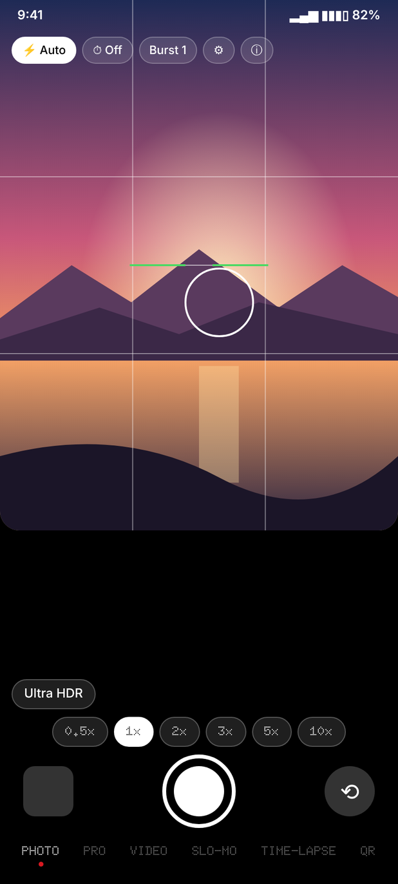
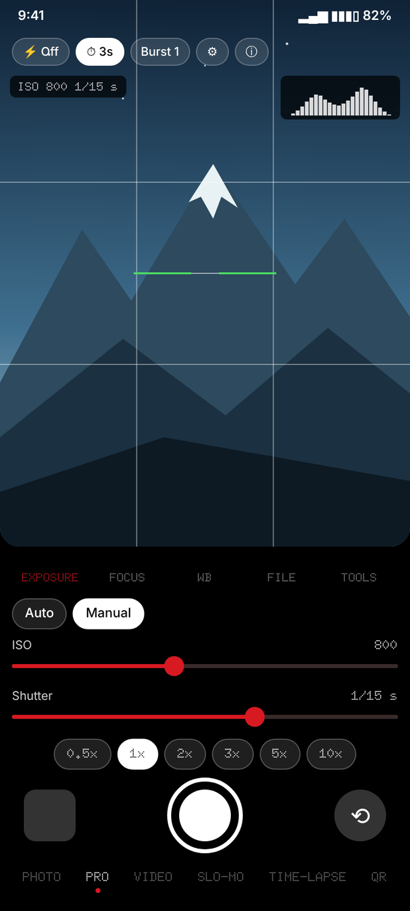
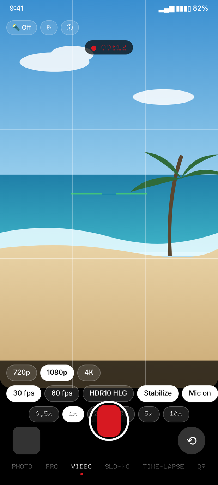
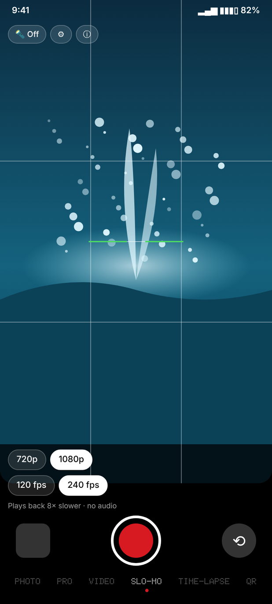
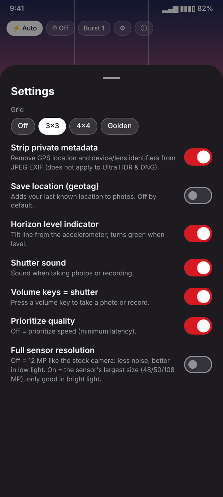

# OmniCam

A privacy-first, open-source camera app for Android, built to get the most out of older phones' cameras:
it uses every capability the camera reports (manual controls, RAW, high-speed video, variable aperture, OIS) and relies on
the phone's own image processing for clean, natural results. OmniCam combines ideas from Open Camera, GrapheneOS Camera,
FreeDcam, Fossify Camera, MA Camera, Libre Camera and CameraX Info into one app. The code is written from scratch in
Kotlin with Jetpack Compose, CameraX and Camera2 interop.

<p align="center">
  
  
  
  
  
</p>
<p align="center"><sub>PHOTO · PRO · VIDEO · SLO-MO · Settings (interface previews rendered from the app's UI; the scenes are illustrations)</sub></p>

> **Status: early test build.** OmniCam builds successfully but has only been tested on one device so far.
> Expect bugs, especially in RAW capture, slow motion and manual controls. Please report issues.

**Requirements:** Android 11 (API 30) or newer.

## Download
Get the latest APK from [Releases](../../releases). Test builds are marked as *pre-release*.

From 0.3.5 on, releases are optimized (R8) and signed with a permanent key, so future updates install over the
previous version. Versions up to 0.3.4 were debug builds with a temporary key (installed as a separate app,
package `app.omnicam.dev`): uninstall that one once. Your photos and videos stay in your gallery.

## Features
| Feature | Inspired by |
|---|---|
| Photo, video and QR modes | GrapheneOS Camera |
| QR/barcode scanner (ZXing, no Play Services; never opens links automatically) | GrapheneOS Camera |
| Strips GPS and device identifiers from JPEG EXIF; location off by default; permissions asked only when needed | GrapheneOS Camera |
| Manual ISO, shutter speed, focus, white balance presets, EV compensation | Open Camera, FreeDcam, Native Camera |
| iPhone-style brightness bar in PHOTO/VIDEO: tap the viewfinder, drag the sun up or down; double-tap to reset (front and back cameras) | iOS Camera |
| Aperture control on variable-aperture lenses (e.g. Galaxy S9/S9+: f/1.5 and f/2.4) in manual exposure | Native Camera |
| RAW (DNG), RAW+JPEG, Ultra HDR (where the device supports them) | Open Camera, FreeDcam, Native Camera |
| Histogram, zebra stripes, focus peaking | FreeDcam |
| Timer (3/10 s), burst (3/5/10), grids (3×3, 4×4, golden), volume keys as shutter | Open Camera, Fossify, Libre Camera |
| Zoom chips and lens picker (35 mm equivalent) | GrapheneOS Camera, MA Camera |
| Video: 4K/1080p/720p/480p, 30/60 fps, HDR10 HLG, stabilization, mic toggle, pause/resume, torch | GrapheneOS Camera, Libre Camera |
| SLO-MO mode: hardware high-speed recording (e.g. 120/240 fps) with OmniCam's own Camera2 recorder (falls back to the older high-speed session API some drivers need, and waits for the camera to be released before switching modes), saved as slow-motion video | FreeDcam, Open Camera |
| TIME-LAPSE mode, iPhone-style: one button, no settings. Speed starts at 15x and doubles automatically the longer you record, so the finished clip stays about 20–40 s at a uniform speed (frames are all-intra, so older frames can be thinned without re-encoding). Smooth by design: digital stabilisation (global motion from the median of 3x3 tiles, smoothed camera path, moving crop), deflicker (weighted moving average of brightness), and focus/white balance locked while recording | iOS Camera, vid.stab, timelapse-deflicker |
| Video bitrate set at or above stock camera apps (e.g. 18 Mbps at 1080p30, 48 Mbps at 4K30) instead of the device default | Open Camera |
| Optical image stabilization kept on for photo and video when the lens has OIS | — |
| Screen-as-flash for photo, and a bright white-screen light with a small live-preview corner while recording video, on cameras with no physical flash (typically the front camera) | Snapchat-style front flash |
| Horizon level indicator | Open Camera |
| Works as the camera for other apps (`IMAGE_CAPTURE` / `VIDEO_CAPTURE`) | Open Camera, Fossify, GrapheneOS Camera |
| Camera info screen (hardware level, capabilities, sensor, RAW sizes, extensions) with a copyable report | CameraX Info |

Every feature is enabled only if your camera reports support for it. Open **Settings → Camera info** to see what
your device exposes, and use **Copy report** when filing a bug.

## Design
Nothing-inspired look: pure black, white and a single red accent, outline pills, and the dot-matrix typeface
[Doto](https://github.com/oliverlalan/Doto) (SIL OFL 1.1) for modes, numbers and readouts. The font is subset to Latin
and digits (about 50 KB). OmniCam is not affiliated with Nothing Technology.

## Privacy and security
- **No INTERNET permission.** The app cannot send data anywhere.
- No Play Services, ads, analytics or trackers. App backups are disabled (`allowBackup=false`).
- Location is off by default and only requested when you enable geotagging. The microphone is only requested for video with audio.
- JPEG metadata (GPS, device and lens identifiers) is stripped by default. QR codes never open links automatically.
- Not yet done: independent security audit, reproducible builds, broad device testing. OmniCam does not claim to be as
  hardened as GrapheneOS Camera.

## Tested devices
| Device | Android | Result |
|---|---|---|
| Samsung Galaxy S9+ (Exynos 9810), Pixel Experience 13 (custom ROM) | 13 | Photo and video work; 4K records a steady 30 fps (viewfinder tears while recording 4K, see known issues). |
| Samsung Galaxy S20 Ultra (SM-G988B), PixelOS custom ROM (earlier: stock One UI 13) | 16 | On One UI: blurry viewfinder (fixed in 0.3.3), vendor modes froze (removed in 0.4.3), slow motion unreliable. Now on PixelOS: 0.4.5 under test. |
| Huawei P50 Pro, HarmonyOS (Android 12 base) | 12 | 0.3.9: black viewfinder after SLO-MO and cut-off QR tab fixed (confirmed). SLO-MO itself froze and recordings failed; 0.3.10 follows Google's official preview-only / recording-session flow, retries at a lower frame rate or with a compatibility recorder, and otherwise hides SLO-MO on that phone. |

Tested it on another device? Open an issue with the output of **Copy report**.

## Known issues
- **Fixed in 0.3.3:** the viewfinder previously rendered through `TextureView` (`ImplementationMode.COMPATIBLE`),
  which is documented by Android to add an extra blending pass and can look softer than the default `SurfaceView`
  (`PERFORMANCE`) mode — reported as a blurry/pixelated live preview on a Galaxy S20 Ultra. OmniCam now defaults to
  `PERFORMANCE` and only switches to `COMPATIBLE` for the brief moments the preview is resized into the small corner
  thumbnail (front-camera white-light video mode). Not yet confirmed fixed on the reporter's device.
- **4K viewfinder on some custom ROMs (e.g. Galaxy S9+ / Pixel Experience 13):** the camera driver tears the viewfinder
  while recording 4K; the saved video is clean and a steady 30 fps. Native Camera shows the same. Routing the viewfinder
  through the recording stream (CameraX stream sharing, tried in 0.3.6 and with a minimal custom GL copy) removes the
  tearing but drops 4K video to about 24 fps on this phone, because every 4K frame then has to pass through the GPU and be
  converted again for the video encoder. OmniCam therefore keeps the plain path: smooth 30 fps recordings first.
- Tap to focus works like stock camera apps: the tapped spot holds focus and brightness until you turn the phone to a
  new scene, then focus, exposure and the brightness slider go back to fully automatic.
- Photos are saved at about 12 MP by default, like stock camera apps: 48/50/108 MP sensors combine several pixels
  into one, which gives less noise and better low light. "Full sensor resolution" in Settings saves the largest size.
- Video stabilization is on by default (like stock camera apps) where the device supports it, and is turned off
  automatically if the phone rejects it.
- Vendor modes (HDR / Night / Portrait from the phone maker) were removed in 0.4.3: on tested Samsung phones they froze
  the camera even when run with the phone's own settings only. PHOTO uses the phone's normal image processing.
- Slow motion: high-speed recording by third-party apps is known to be unreliable on many Samsung models (reported for
  the Galaxy S9, S10e and S20 main camera, while newer models such as the S24+ work), and the result differs per model
  and firmware. OmniCam retries once, then tries the settings of Google's
  official sample, then a lower frame rate; if nothing works, SLO-MO is hidden on that phone and video is used.
- Compared with a manufacturer's own camera app, video may still look less polished: stock apps use private
  processing (tuned noise reduction and sharpening, gyro stabilization such as Samsung Super Steady, HDR10+) that
  Android does not expose to other apps. OmniCam matches what it can control, such as bitrate and OIS.
- On phones with a depth-sensing auxiliary camera (used for portrait blur), that sensor is filtered out of the lens
  picker: it cannot take a normal photo or video.

## Roadmap
- RAW video (MotionCam-style)
- Exposure/focus bracketing, timelapse, panorama
- Choosing a save folder (SAF / SD card); honoring duration/size limits for `VIDEO_CAPTURE`
- Direct access to physical cameras not exposed through CameraX
- Night mode and HDR from a multi-frame burst (GCam-style merge), only once it beats the phone's own processing
- Screen light auto-brightness matched to ambient darkness, instead of a fixed on/off toggle
- RGB histogram / waveform, translations, automated tests
- A permanent release signing key and a stable release

## References
Behaviour was checked against these open-source camera apps and samples (no code copied):
Google's [android/camera-samples](https://github.com/android/camera-samples) (Camera2 and CameraX slow motion),
[FreeDcam](https://github.com/KillerInk/FreeDcam) (vendor quirks, high-speed sessions),
[LineageOS Aperture](https://github.com/LineageOS/android_packages_apps_Aperture) (CameraX on many devices),
[GrapheneOS Camera](https://github.com/GrapheneOS/Camera), [Fossify Camera](https://github.com/FossifyOrg/Camera),
[MotionCam](https://github.com/mirsadm/motioncam), CameraX Info, and for time-lapse encoding
[Grafika](https://github.com/google/grafika) and [TimeLapseRecordingSample](https://github.com/saki4510t/TimeLapseRecordingSample) (Apache-2.0);
for smooth time-lapses [timelapse-deflicker](https://github.com/cyberang3l/timelapse-deflicker) (GPL-3.0),
[Karry/TimeLapse](https://github.com/Karry/TimeLapse) (weighted-moving-average deflicker) and the path-smoothing idea of
[vid.stab](https://github.com/georgmartius/vid.stab).

## Building
**GitHub Actions:** every push runs the *Build APK* workflow. With the signing secrets configured
(`OMNICAM_KEYSTORE_B64`, `OMNICAM_KEYSTORE_PASSWORD`, `OMNICAM_KEY_ALIAS`, `OMNICAM_KEY_PASSWORD`) it produces a signed,
optimized `omnicam-release-apk`; without them (e.g. in forks) it falls back to `omnicam-debug-apk`.
Forks: open the *Actions* tab and enable workflows first.

**Android Studio:** open the project, let Gradle sync, then *Build → Build APK(s)*. Output: `app/build/outputs/apk/debug/`.
`gradle-wrapper.jar` is not included; Android Studio generates it, or run `gradle wrapper`.

## Project structure
```
app/src/main/java/app/omnicam/
  MainActivity.kt, CameraViewModel.kt
  ExternalCapture.kt          # IMAGE_CAPTURE / VIDEO_CAPTURE for other apps
  camera/CameraEngine.kt      # CameraX binding, photo/video, manual controls
  camera/Analyzers.kt         # histogram / zebra / peaking and QR scanner
  camera/HighSpeedRecorder.kt # Camera2 constrained high-speed slow-motion recorder
  camera/TimelapseRecorder.kt # automatic time-lapse: frame sampling, all-intra encoding, uniform thinning
  camera/CameraInspector.kt   # camera info screen
  storage/Storage.kt          # preferences, MediaStore output, EXIF scrubbing, geotagging
  model/Models.kt             # UI state and helpers
  ui/                         # CameraScreen, Panels, Components, SettingsAndInfo, Level, ScreenLight (screen-as-flash)
```

## License
GPL-3.0-or-later. See [LICENSE](LICENSE) and [NOTICE](NOTICE).
